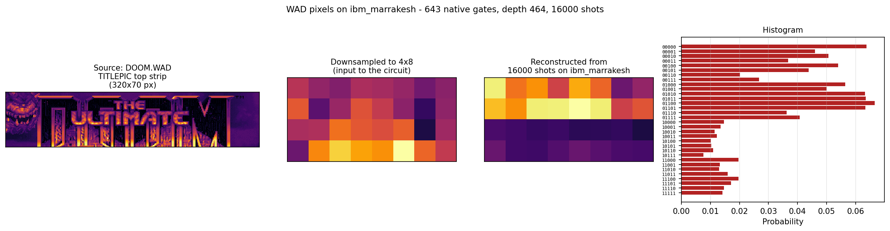

# Ernest

Ernest is a quantum compiler. It is named after Ernest Rutherford, of Brightwater, Nelson, 1871-1937.

In 1909 Rutherford had two of his students fire alpha particles at gold foil to see what would happen. A small number of them came back. He likened the experience to firing a fifteen-inch naval shell at tissue paper and having it return to introduce itself. From this he worked out that atoms have nuclei. Most compiler bugs feel similar.

He won the Nobel Prize in Chemistry, which he resented on the grounds (so the story goes) that all science was either physics or stamp collecting. I honour his memory by writing this in C99, which is neither.

Rutherford appears on the New Zealand one hundred dollar note. This is also, by happenstance, the approximate cost of running one Bell state on real quantum hardware. The compiler is named after the bill it will print.

## Bethesda's *DOOM* title screen on a real quantum computer



The leftmost panel is the actual `TITLEPIC` lump from a legally-purchased `DOOM.WAD`. You can read "THE ULTIMATE DOOM" along the bottom; the demon's head is on the left. The next panel is that strip downsampled to a 4-by-8 grid of brightness values, normalised to a 5-qubit statevector. Ernest then compiled the state-prep plus a QFT-and-inverse-QFT pair to 311 IBM-native gate lines, which IBM's transpiler expanded to 643 gates at depth 464 on `ibm_marrakesh`, a 156-qubit Heron r2 in Washington DC. The third panel is what came back from sixteen thousand measurement shots in 9.8 seconds. The top half of the reconstruction tracks the input pattern faithfully; the bottom half is suppressed by the chip's readout asymmetry, which biases the leftmost qubit toward |0> during measurement. You can see the same bias in the histogram on the right.

So that is real *id Software* pixels, from a real WAD, encoded as a real quantum state, run through a real superconducting chip in Virginia, and measured back into pixels. Compiled by this thing.

## What Ernest is

A dependency-free C99 compiler for OpenQASM 3. It reads what Qiskit writes, optimises what it reads, decomposes the result to a target vendor's native gate set, and either simulates the circuit through an interpreted statevector simulator or ahead-of-time compiles it to native machine code by handing it to gcc. There is no LLVM and no Python. The whole thing builds with `make`.

Where Ernest tries to differ from the rest of the field is the diagnostics. Every gate in the output knows which line of source produced it. Every transformation pass announces what it did and why. Every compilation is byte-deterministic, so the same input always produces the same output. And every demo can be put through a statevector-equality check before any real hardware time gets spent.

## What you get if you run it

```
$ make
$ ./ernest bell
```

Ernest builds a Bell state, optimises it, prints the intermediate representation, prints the OpenQASM, and runs eight thousand shots through the statevector simulator. If quantum mechanics is still operating on its usual principles, the histogram is roughly half `|00>` and half `|11>` and almost nothing in between. The two qubits made the same call without consulting each other, which Einstein found objectionable and the rest of us have learnt to live with. Yeah nah, it's fine.

```
  Histogram (8192 shots)
  ---------------------------
  |00>    4144  ####################   50.6%
  |11>    4048  ####################   49.4%
```

She's all sorted.

## A walk through the bigger pieces

### Provenance through the whole pipeline

Every TIR instruction carries a source line, a source column, and a stamp from whichever pass produced it. The `--xref` flag prints a cross-reference listing showing all three for every gate in the output, the way a mainframe XREF for COBOL or PL/I would.

```
$ ./ernest --xref --target=ibm compile test/qiskit_corpus/samples/bell.qasm
...
  IDX  ORIGIN   SRC        INST
    0  PARSE    3:1        creg c[2]
    1  PARSE    4:1        qreg q[2]
    2  OPTDECP  5:1        rz(1.570796) q[0]
    3  OPTDECP  5:1        sx q[0]
    4  OPTDECP  5:1        rz(1.570796) q[0]
    5  PARSE    6:1        cx q[0], q[1]
    6  PARSE    7:1        measure q[0] -> c[0]
    7  PARSE    8:1        measure q[1] -> c[1]
```

The Hadamard at line 5 of the input has become three native gates in the output. All three remember where they came from. Should anything later go wrong on the hardware, you can walk the chain from a misbehaving native gate back to the source statement that asked for it.

### The optimisation pipeline

The compiler runs through a small, named, mainframe-style pass manager.

```
ERNESTOP START   OPT=1  TARGET=IBM  PASSES=6  INSTS=6
  STEP ERNESTQL  IN=6  OUT=6  REMOVED=0  ITER=1  RC=0
  STEP OPTGCAN   IN=6  OUT=6  REMOVED=0  ITER=1  RC=0
  STEP OPTFUSE   IN=6  OUT=6  REMOVED=0  ITER=1  RC=0
  STEP OPTDECP   IN=6  OUT=8  ADDED=2  ITER=1  RC=0
  STEP OPTFUSE2  IN=8  OUT=8  REMOVED=0  ITER=1  RC=0
  STEP OPTGCAN2  IN=8  OUT=8  REMOVED=0  ITER=1  RC=0
ERNESTOP ENDED   IN=6  OUT=8  RC=0
```

ERNESTQL is the linter. It catches the structural mistakes a careful reader of the OpenQASM would catch and a careless one wouldn't: qubits declared but never operated on, qubits operated on but never measured, gates applied to a qubit after measurement without an intervening reset, and a small handful of others. Findings go through the MNOTE channel with source line and column.

OPTGCAN drops adjacent gate pairs that cancel. Self-inverse Cliffords (H·H, X·X, CX·CX, the works), S·SDG, T·TDG. OPTFUSE adds adjacent same-axis rotations and reduces the combined angle modulo 2π, dropping the pair entirely if the sum is zero. OPTDECP rewrites every non-IBM-native gate as a sequence drawn from `{RZ, SX, X, CX}`. The trailing OPTFUSE2 and OPTGCAN2 mop up the adjacencies decomposition tends to create.

Adding a pass is appending one row to the pass table. Nothing else needs to change.

### The religious correctness verifier

This is the one to run before any hardware submission.

```
$ ./ernest verify
ERNESTJB VERIFY START
---------------------------------------------------
SV tolerance:    1e-09   (statevector max pointwise)
Hist tolerance:  0.020  (total variation distance)
Histogram shots: 100000
---------------------------------------------------
  [PASS] bell          sv_diff=1.570e-16  hist_tvd=0.00249
  [PASS] ghz           sv_diff=1.570e-16  hist_tvd=0.00027
  [PASS] deutsch       sv_diff=1.688e-16  hist_tvd=0.00002
  [PASS] grover        sv_diff=4.228e-16  hist_tvd=0.00001
  [PASS] qftlib        sv_diff=2.627e-16  hist_tvd=0.00003
  [PASS] groverlib     sv_diff=4.228e-16  hist_tvd=0.00002
---------------------------------------------------
ERNEST VERIFY  PASS=6  FAIL=0  OF=6
```

For each demo, the verifier independently simulates the abstract circuit and the IBM-decomposed circuit, then checks the two statevectors are equal up to a global phase. This proves the decomposition is mathematically correct, not just statistically close. Then it runs the IBM-decomposed module through both the interpreted simulator and the AOT pipeline, computes total variation distance between the two histograms, and fails the row if either check is loose.

This caught a real bug during development: gcc's `-O3` tree vectoriser was reordering floating-point operations in ways that compounded across long phase-rotation circuits. The bug presented as a histogram divergence of 13% on the QFT round-trip. The fix was a one-flag tweak to the AOT gcc command, and the bug never made it past the verifier and onto real hardware.

If your circuit doesn't pass `verify` on the demos that look like yours, don't submit it.

### The ahead-of-time simulator

The default simulator dispatches every TIR instruction through a switch statement. The `--aot` flag writes a self-contained C program from the optimised module, hands it to `gcc -O3 -fno-tree-vectorize`, then runs the resulting binary. The dispatch goes away. The gate sequence becomes straight-line code that gcc inlines, registerises, and treats as the small program it actually is.

```
$ time ./ernest      bell 5000000   # interpreted
real    0m40.154s

$ time ./ernest --aot bell 5000000   # AOT
real    0m0.460s
```

That's roughly ninety times faster on the longer runs. The fixed cost of invoking gcc and writing a binary to disk amortises across the shot count; below about ten thousand shots the interpreted path wins, above that the AOT path is uncontested.

### libqstd, the quantum standard library

You can compose programs out of named, well-known primitives instead of laying them out gate by gate.

```c
#include "qstd.h"

void build_my_module(tir_module_t *M)
{
    tir_module_init(M, "my_demo");
    uint32_t q = tir_qreg(M, "q", 4u);
    uint32_t c = tir_creg(M, "c", 4u);

    tir_emit_x(M, TIR_REF(q, 0u));   // start in |0001>
    qstd_qft (M, q, 4u);              // forward transform
    qstd_iqft(M, q, 4u);              // and back again

    for (uint32_t i = 0u; i < 4u; i++)
        tir_emit_measure(M, TIR_REF(q, i), TIR_REF(c, i));
}
```

Three function calls instead of fifty-odd `tir_emit_*` calls and a handwritten phase ladder. libqstd carries:

- `qstd_qft` and `qstd_iqft` for the QFT pair
- `qstd_uniform_superposition` for the standard Hadamard wall
- `qstd_phase_oracle` for marking a chosen bit-string
- `qstd_grover_diffusion` for the reflection step

Each primitive has citations in the source.

## The Qiskit corpus

`./ernest corpus` reads twelve OpenQASM 3 files written by `qiskit.qasm3.dumps` and reports how many of them Ernest parses cleanly. The current score is twelve out of twelve, including the QFT (uses `cp`), Toffoli (uses `ccx`), W state (uses `ch`), and the EfficientSU2 ansatz (twenty-two gates of mixed rotations).

```
ERNEST CORPUS  PASS=12  PFAIL=0  LFAIL=0  IOERR=0  OF=12
```

The corpus also serves as the regression suite for the parser.

## Layout

```
src/tir.h        src/tir.c             The IR. Where circuits live
                                       before they grow up and have
                                       to meet hardware.
src/qasm.h       src/qasm.c            OpenQASM 3 emitter.
src/qasm_lex.h   src/qasm_lex.c        ERNESTLX. The lexer.
src/qasm_parse.h src/qasm_parse.c      ERNESTPR. The parser.
src/expr_eval.h  src/expr_eval.c       Angle expression evaluator.
src/opt.h        src/opt.c             The pass manager. QLINT, OPTGCAN,
                                       OPTFUSE, OPTDECP, post-decomp
                                       cleanup. Add a pass by appending
                                       one row.
src/sim.h        src/sim.c             ERNESTSM. Statevector simulator,
                                       up to sixteen qubits.
src/aot.h        src/aot.c             AOT code generator. Emits C,
                                       shells out to gcc, runs the
                                       result, captures the histogram.
src/qstd.h       src/qstd.c            libqstd. The quantum standard
                                       library.
src/mnote.h      src/mnote.c           Mainframe-style diagnostic
                                       channel. Severity 0/4/8/12/16,
                                       same as JES.
src/abend.h      src/abend.c           ERNESTDM. ABEND dump formatter
                                       with PSW, trace, and register
                                       map.
src/main.c                             The dispatcher.
demos/*.c                              Circuits, harnesses, the
                                       verifier, the corpus harness.
test/qiskit_corpus/                    Generated samples from
                                       qiskit.qasm3.dumps. Used by
                                       the corpus test.
Makefile                               Builds with the warning
                                       regime cranked to "deeply
                                       unimpressed".
```

## Building

You need a C99 compiler, GNU make, and Python with Qiskit if you want to regenerate the corpus samples (one-off, the samples are checked in).

```
make                       build the release binary
make smoke                 build and check the demo doesn't cark it
make clean                 tidy up
```

Circuit demos:

```
./ernest bell              two-qubit Bell state
./ernest ghz               three-qubit GHZ state
./ernest deutsch           Deutsch's algorithm
./ernest grover            two-qubit Grover search
./ernest qftlib            QFT round-trip via libqstd
./ernest groverlib         Grover via libqstd primitives
```

Compiler subcommands:

```
./ernest compile <path>    parse, optimise, print a QASM file
./ernest verify            religious correctness across every demo
./ernest corpus            parse the Qiskit-generated QASM corpus
./ernest roundtrip         build, emit, lex, parse, compare
./ernest lex               run the lexer on emitted Bell QASM
./ernest abend             deliberately trigger an ABEND
./ernest opt               optimisation demo with cancellation + fusion
```

Flags:

```
--target generic|ibm       target vendor for decomposition (default: generic)
--no-opt                   skip the optimiser
--xref                     print the cross-reference listing
--aot                      simulate via AOT-compiled native code
```

Examples:

```
./ernest --target=ibm --xref compile some.qasm        # compile + show provenance
./ernest --aot --target=ibm qftlib 1000000            # AOT-simulate a million shots of QFT
./ernest verify                                       # run before any hardware submission
```

## Roadmap

### Already shipped

The things this document writes about in the present tense, all of which are working in the current build:

- **SABRE qubit routing**, with the full algorithm: DAG-based front layer, lookahead heuristic, per-qubit decay, identity-restoring tail. Hooked into the optimiser pipeline as `OPTROUT`.
- **IBM-native decomposition.** Rewrites every non-native gate into `{RZ, SX, X, CX}`. Four hardcoded coupling topologies (`linear_5`, `linear_16`, `ring_5`, `ring_8`, `grid_4x4`, `heavy_hex_7`, `ibm_falcon_5_t`, `full_16`) plus a file loader for arbitrary device couplings dumped from Qiskit.
- **End-to-end IBM Quantum submission**, demonstrated on `ibm_marrakesh`. Bell state and downsampled DOOM TITLEPIC both ran successfully on real superconducting silicon. See the screenshot at the top of this file.
- **Religious correctness verifier.** Compares the abstract circuit's statevector to the IBM-decomposed circuit's statevector up to a global phase; runs the histogram comparison through both the interpreted simulator and the AOT pipeline. Catches divergence between what you asked for and what the chip will actually do, *before* you spend any of your monthly hardware quota.
- **AOT-compiled native simulator.** Emits a self-contained C program from the optimised TIR, hands it to `gcc -O3 -fno-tree-vectorize`, runs the binary. 20-90× faster than the interpreted simulator on small circuits.
- **Provenance tracking** with cross-reference listings (`--xref`). Every gate in the output knows which line of source produced it, and which pass last touched it.
- **`qlint` static analysis pass.** Unused qubits, gates after measurement, repeat measurements, self-control, all caught as MNOTE diagnostics with source locations.
- **libqstd**, the quantum standard library: QFT, inverse QFT, Grover diffusion, phase oracle, uniform superposition. Composable, cited.
- **Mainframe-flavoured diagnostics.** MNOTE channel, ABEND dumps with PSW + trace + register map, MVS-style SNAP snapshots at every pipeline boundary.
- **12/12 on the Qiskit corpus.** Every OpenQASM 3 file `qiskit.qasm3.dumps` emits across the sample circuits parses cleanly.
- **Byte-deterministic compilation.** Same input produces same output, every run, across both targets. 26/26 byte-identical in the determinism audit.
- **Quantum JCL.** Job-control-language decks (`tools/run_jcl.py`) describe multiple circuits as named steps, compile each one through Ernest, and submit the whole lot as a single batched SamplerV2 job. One queue wait, N histograms back. Mainframe-style job log. Sample deck in `examples/demos.jcl`.

### Still to come

In roughly the order each one starts to look like a good Sunday afternoon.

- **Commutation analysis.** Reorder commuting gates to expose more fusion and cancellation. OPTFUSE rarely bites on Qiskit-shaped input today because Qiskit interleaves rotation axes by design; commutation analysis would let the existing passes catch a lot more.
- **More libqstd primitives.** Ripple-carry adders, phase estimation, amplitude amplification, modular exponentiation, quantum walks. Each is its own afternoon and adds a "compose this" entry to the standard library.
- **More vendor backends.** IonQ (with its native `GPI`/`GPI2`/`MS` basis), Rigetti, Quantinuum. Each is a decomposition pass and a target enum value, following the same shape as the existing IBM target.
- **ZX-calculus rewriting.** Mostly because the diagrams are pretty and the optimisations are real, in that order.
- **Mid-circuit measurement and classical feedforward.** OpenQASM 3 expresses these today but Ernest's pipeline doesn't carry them yet. Adaptive algorithms can't really start until it does.
- **Pulse-level control.** Going below the gate abstraction, into the microwave-waveform-shaping layer where the actual physics lives. Would let Ernest compete with vendor-locked toolchains on noise tolerance.
- **Multi-circuit batching for submissions.** Queue one job that runs several circuits, save quota.
- **Hardware-feasible full-resolution DOOM.** As error correction matures and gate depth budgets grow, the gap between the 32-pixel hardware demo and the 65,536-pixel simulator demo will close. Filed for whenever quantum supremacy stops being an asterisk in marketing material.

## Acknowledgements

This compiler stands on a lot of other people's work. Most of it is older than the author.

**The quantum side.** Quantum image processing as a field began with **Le, Dong, and Hirota (2011)** describing FRQI. It was extended into NEQR by **Zhang, Lu, Gao, and Wang (2013)**, and arrived at the simpler QPIE encoding Ernest actually uses in **Yao et al. (2017)**. The SABRE routing algorithm that lets Ernest target real device topologies is from **Li, Ding, and Xie (2019)**. The gate decomposition templates Ernest uses to lower abstract gates into the IBM-native basis come from **Barenco et al. (1995)**, which is also the paper that proved any quantum computation can be reduced to single-qubit and CNOT gates. Every matrix in the simulator and every algorithm in libqstd is checked against **Nielsen and Chuang's textbook**, which is the most consulted PDF on this hard drive by a comfortable margin.

**The hardware side.** None of this gets near a quantum computer without **IBM Quantum**: the research team who designed the Heron chips, the engineers who keep them at fifteen millikelvin in a data centre on the US east coast, and the people behind the Open Plan who decided to give members of the public ten free minutes of QPU time a month. Several of the screenshots in this README only exist because that quota exists. The **Qiskit team** built the OpenQASM 3 spec Ernest targets, the runtime client that ferries jobs from this machine to the hardware, and the transpiler patterns Ernest's decomposition and routing borrow from. **Cross, Javadi-Abhari, and the OpenQASM 3 working group** designed a language clean enough that a small C99 compiler can parse and emit it.

**The pop-culture side.** **id Software**'s original *DOOM* team (1993) built the engine, the title screen, and the WAD format Ernest now reads through a quantum simulator. The volunteers maintaining **DoomWiki** are why the WAD parser exists at all. The **Freedoom** project keeps the form alive for anyone who doesn't own the original.

**The boring brilliant.** **GCC**, **glibc**, **GNU Make**, **CPython**, **numpy**, **matplotlib**, **MinGW-w64**, and the cumulative decision by the open-source community over the past forty years to ship reliable tools without charging for them. Ernest doesn't link against any of them, but stands on all of them.

Full citations in [`REFERENCES.md`](REFERENCES.md), kept honest in APA 7th.

---

One day, when error-corrected qubits get cheap enough and gate depths get long enough, we'll be able to run real *DOOM* on real quantum computers. Not amplitude-encoded title screens. The whole game. Networked. Multiplayer.

Quantum LAN party. Whoever publishes that paper, save us a seat.

## License

Apache 2.0. See [`LICENSE`](LICENSE), if you're into that sort of thing.
